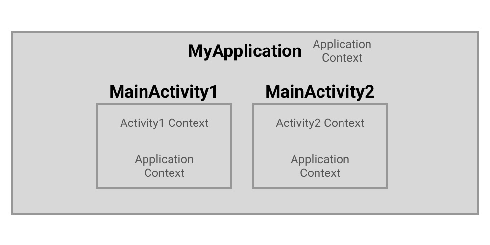

<h1>Context란?</h1>
   

* 애플리케이션의 현재 상태를 나타낸다.
* 액티비티와 어플리케이션의 정보를 얻기 위해 사용할 수 있다.
* 리소스, 데이터베이스, shared preference 등에 접근하기 위해 사용할 수 있다.
* 액티비티와 애플리케이션 클래스는 Context 클래스를 확장한 클래스이다.

   
   

<h2>Application Context</h2>

----

   

애플리케이션 컨택스트는 싱글턴 인스턴스이며, 액티비티에서 getApplicationContext()를 통해 접근할 수 있다.

 이 컨택스트는 애플리케이션 라이프사이클에 묶여있으며, 현재 컨택스트가 종료된 이후에도 컨택스트가 필요한 작업이나 액티비티 스코프를 벗어난 컨택스트가 필요한 작업에 적합합니다.

예를 들어, 애플리케이션에 싱글턴 오브젝트를 생성하고, 해당 오브젝트에 컨택스트가 필요하다면 항상 애플리케이션 컨텍스트를 전달해야 한다. 

만약 액티비티 컨택스트를 전달한다면, 해당 오브젝트는 액티비티를 항상 참조하므로, 액티비티가 화면에 표시되지 않는 순간에도 가비지 콜렉션이 진행되지 않아 메모리 누수가 발생하게 된다.
애플리케이션 전체에서 사용할 라이브러리를 특정 액티비티에서 초기화한다면 당연히 Application Context를 사용해야 한다. getApplicationContext()는 딱 위와 같은 경우에만 사용할 것.

   
   
<h2>Activity Context</h2>

----

   

Activity Context는 activity 내에서 유효한 컨택스트이다. 

이 컨택스트는 액티비티 라이프사이클과 연결되어 있고. 액티비티 컨택스트는 액티비티와 함께 소멸해야 하는 경우에 사용해야 한다. 예를 들어, 액티비티와 라이프사이클이 같은 오브젝트를 생성해야 할 때 액티비티 컨택스트를 사용할 수 있다.

앱의 계층 구조

* Application Context는 MyApplication, MainActivity1, MainActivity2 모두에서 사용할 수 있다.
* MainActivity1의 Context는 MainActivity1에서만 사용할 수 있다.
* MainActivity2의 Context는 MainActivity2에서만 사용할 수 있다.

   
   

<h2>ContentProvider의 getContext()</h2>

----

추상 클래스 ContentProvider를 상속한 클래스에서 getContext() 메소드를 통해 불러올 수 있는 컨택스트는 애플리케이션 컨택스트.

   
   

<h2>언제, 어떤 Context를 사용해야 할까?</h2>

----

상황을 가정하여 언제, 어떤 Context를 사용할 지 알아보자. class MyApplication과 class MyDB 싱글턴이 있다고 가정한다. 그리고 MyDB가 context가 필요한 상황이라면, 어떤 context가 필요할까?
정답은 Application Context입니다. 만약 Activity의 Context를 전달했다면, 액티비티가 사용되지 않는 경우에도 MyDB가 불필요하게 액티비티를 참조하고, 메모리 누수가 발생하게 된다. 그러므로 싱글턴의 경우에는 항상 애플리케이션 컨택스트를 전달하는 게 맞다.
그렇다면 언제 Activity Context를 사용해야 할까? 언제든 액티비티를 사용할 때, Toast, Dialog 등의 UI operation에서 컨택스트가 필요하다면 이때 액티비티 컨택스트를 사용해야 한다.
항상 가능한 한 가까운 컨택스트를 사용하도록 하자. 액티비티에 있다면, 액티비티 컨택스트를, 애플리케이션에 있다면, 애플리케이션 컨택스트를 사용합니다. 싱글턴의 경우에는 애플리케이션 컨택스트를 사용.

   
   

<h2>getApplicationContext()를 쓰면 안 되는 경우</h2>

----
   

* Application Context는 Activity Context가 제공하는 기능 전체를 제공하진 않는다. 특히 GUI와 관련된 컨택스트 조작은 실패할 확률이 높다.

* Application Context가 사용자 호출로 생성된, clean up 되지 않은 객체를 가지고 있다면 메모리 누수가 발생할 수 있다. Activity 객체는 가비지 콜렉션이 가능하지만 Application 오브젝트는 프로세스가 살아있는 동안 남아있다.

   
   
<h2>Reference<h2>

----

* https://developer.android.com/reference/android/content/Context

* https://roomedia.tistory.com/entry/Android-Context%EB%9E%80-%EB%AC%B4%EC%97%87%EC%9D%BC%EA%B9%8C